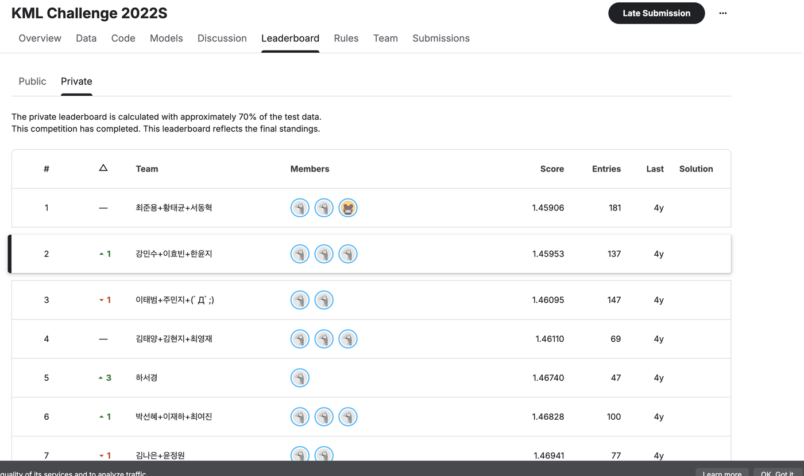

# 백화점 고객 구매 이력 분류

[](https://www.python.org) [](LICENSE)

국민대학교 머신러닝 수업의 학기말 Kaggle 경진대회(KML Challenge 2022S) 기록입니다. 백화점 1년치 구매 트랜잭션을 고객 단위로 임베딩해 성별×연령대 8개 그룹을 분류했고, 3인 팀으로 참가해 Private 리더보드 2위에 올랐습니다.

## 개요

| 구분 | 내용 |
| --- | --- |
| 수업 | 국민대학교 머신러닝 |
| 기간 | 2022.03 – 2022.06 |
| 형태 | 팀 프로젝트 (3인) |
| 대회 | Kaggle KML Challenge 2022S (수업 내 경진대회) |
| 과제 | 구매 이력 기반 고객 성별×연령대 8개 그룹(F20–M50) 분류 |
| 평가지표 | Multi-class log loss |
| 결과 | Private 2위 (log loss 1.45953) |

## 접근

- 고객(custid)의 구매 트랜잭션을 브랜드·코너·파트·상품·고객정보 시퀀스로 모아 Word2Vec으로 임베딩하고, 고객별로 벡터를 집계해 피처로 만들었습니다. 분류 수준별 임베딩 스크립트는 [src/](src/)에 있습니다.
- 구매 목록이 짧은 고객이 많아, 목록을 여러 번 늘려(oversampling) 임베딩 학습을 보강했습니다.
- 매장·파트·상품 같은 범주형 정보에서 파생 변수를 만들고, category encoder로 변환한 뒤 SHAP 값으로 기여도가 높은 피처를 골랐습니다.
- CatBoost·LightGBM·XGBoost와 DNN(Keras·PyTorch)·MLP(ktrain)를 학습하고, 여러 제출을 평균으로 블렌딩했습니다.
- 노트북 실행 순서는 [reports/notebook_execution_order.md](reports/notebook_execution_order.md)에 정리했습니다.

## 저장소 구성

원본 협업 당시의 폴더 구조와 파일명을 최대한 그대로 남겼습니다.

```text
.
├── notebook/
│   ├── 2nd feature/            # 피처 생성과 개별 모델 노트북
│   └── 2nd feature + vector/   # 임베딩 벡터를 더한 피처·모델 노트북
├── src/                        # 분류 수준별 Word2Vec 임베딩 스크립트
├── submission/
│   └── ensemble/               # 제출 블렌딩 노트북
├── Self-produced_code/         # 모델·앙상블 코드를 따로 정리한 노트북
├── reports/
│   ├── kaggle_leaderboard.png       # Private 리더보드 기록
│   └── notebook_execution_order.md  # 노트북 실행 순서
├── requirements.txt
└── README.md
```

## 리더보드



수업 내 Kaggle 경진대회 KML Challenge 2022S의 Private 리더보드입니다. 3인 팀으로 참가해 log loss 1.45953으로 2위를 기록했고, 팀 구성은 리더보드 화면에 그대로 남아 있습니다.

## 공개 범위

- 수업 데이터셋(구매 트랜잭션·정답 라벨)과 생성 피처·학습 모델·제출 파일은 포함하지 않았습니다. 대회 데이터라 재배포할 수 없어, 노트북에서는 데이터 경로만 `data/`로 참조합니다.
- 노트북 출력은 고객 데이터 미리보기와 개인 실행 환경 경로가 들어 있어 비웠습니다.
- 코랩 드라이브 절대경로와 파일명에 있던 개인 정보는 정리했습니다.

## 링크

- [대회 페이지](https://www.kaggle.com/competitions/kml2022s)
- [최종 리더보드](https://www.kaggle.com/competitions/kml2022s/leaderboard)

## 라이선스

Apache License 2.0. 자세한 내용은 [LICENSE](LICENSE)에 있습니다.
